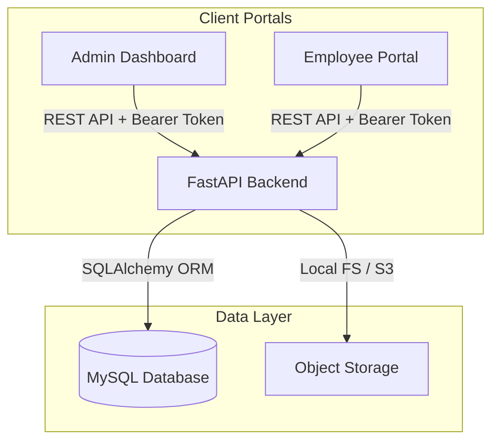

# Dayflow HRMS — Enterprise Human Resource Management System

Dayflow is a modern, premium, and feature-rich Human Resource Management System (HRMS) built to streamline employee operations, attendance tracking, leave applications, profile administration, and payroll management. It features a scalable FastAPI backend coupled with dedicated frontend portals for both Administrators/HR Managers and Employees.

---

## 💻 System Architecture



---

## 🚀 Key Features

### 1. User Authentication & Role-Based Access Control (RBAC)
* Secure authentication using JWT access and refresh tokens.
* Three distinct roles: **Admin**, **HR**, and **Employee**.
* Admin/HR panel to invite new users dynamically with custom role selection (Admin, HR, or Employee).

### 2. Employee Directory & Profiles
* Detailed profile view showcasing contact info, department, designation, and joining details.
* Custom, persistent resume section detailing experience, certifications, and skills per employee.
* Interactive profile avatar uploads featuring secure server-side verification (Pillow validation & dimensions capping) and unauthenticated raw image streaming routes.

### 3. Leave & Time-Off Management
* **Interactive 2026 Annual Calendar Grid** for employees showing color-coded days for approved leaves (green), pending requests (orange), public holidays (red), and weekends (grey).
* Dynamic leave validity period (Allocation Days) calculations.
* Mandatory document/certificate upload verification for specific leave types (e.g., Sick Leave).
* Manager review overlays allowing optional comments and feedback during leave approval/rejection.

### 4. Attendance Tracking
* Check-in and Check-out capabilities with real-time location mapping.
* Total working hours and overtime calculations.
* Visual status timelines showing punctuality metrics and corrections.

### 5. Payroll & Salary Structures
* Admin salary control panel for editing monthly base wages and structures.
* Complete monthly breakdown: Basic Salary (50%), House Rent Allowance (25%), Standard Allowance (15%), Performance Bonus, Leave Travel Allowance (LTA), Fixed Allowance, PF (Provident Fund), and Professional Tax.
* Read-only payroll screen for employees featuring a printable, premium-styled **Monthly Payslip**.

---

## 🛠️ Technology Stack

| Component | Technology | Description |
| :--- | :--- | :--- |
| **Backend Framework** | [FastAPI](https://fastapi.tiangolo.com/) | High-performance Python Web framework |
| **ORM** | [SQLAlchemy](https://www.sqlalchemy.org/) | Python SQL toolkit and Object Relational Mapper |
| **Database** | [MySQL](https://www.mysql.com/) | Relational database management system |
| **Password Hashing** | [Passlib](https://passlib.readthedocs.io/) | Argon2 & Bcrypt secure hashing algorithms |
| **Frontend Tooling** | [Vite](https://vite.dev/) | Next-generation frontend build tool |
| **Admin Portal** | React + TypeScript | Fully typed dashboard interface |
| **Employee Portal** | React + JavaScript (ES6) | Responsive, mobile-first self-service portal |
| **Styling** | Bootstrap 5 + CSS | Sleek styling with custom design tokens |

---

## 📦 Installation & Setup

### Prerequisites
* Python 3.10+
* Node.js 18+
* MySQL Server 8.0+

---

### 1. Backend Configuration

Navigate into the backend folder:
```bash
cd backend/dayflow_backend
```

Create and activate a virtual environment:
```bash
python -m venv .venv
# On Windows
.venv\Scripts\activate
# On macOS/Linux
source .venv/bin/activate
```

Install dependencies:
```bash
pip install -r requirements.txt
pip install argon2-cffi
```

Create a `.env` file from the example:
```bash
cp .env.example .env
```
Update your `.env` database connection:
```env
DATABASE_URL=mysql+pymysql://<username>:<password>@localhost:3306/dayflow_hrms
```

Run database migrations:
```bash
alembic upgrade head
```

Start the FastAPI application:
```bash
uvicorn app.main:app --reload --port 8000
```

---

### 2. Admin Frontend Setup

Navigate into the admin frontend folder:
```bash
cd frontend/admin
```

Install dependencies:
```bash
npm install
```

Start the Vite development server:
```bash
npm run dev
```

Build for production:
```bash
npm run build
```

---

### 3. Employee Frontend Setup

Navigate into the employee frontend folder:
```bash
cd frontend/employee-v2
```

Install dependencies:
```bash
npm install
```

Start the Vite development server:
```bash
npm run dev
```

Build for production:
```bash
npm run build
```

---

## 🔒 Security Best Practices
* **Hashing**: Passwords are securely hashed with `argon2` before writing to the database.
* **CORS Settings**: Allowed origins are restricted in production through configurations.
* **File Uploads**: Restricts file validation limits (capping at 5MB for images and 10MB for documents) and validates MIME types and file signatures before executing storage operations.
